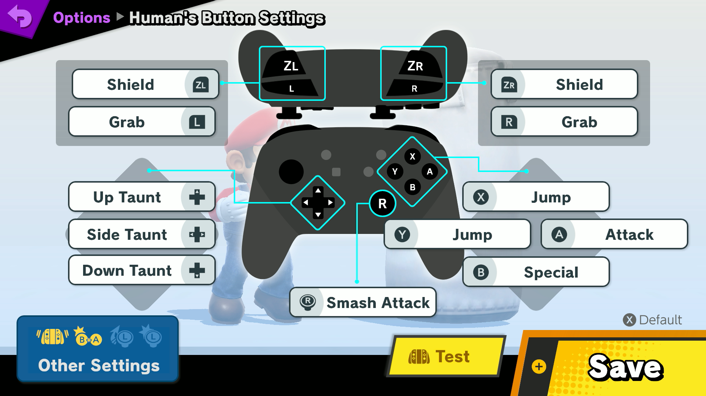

Use the following controls in game

# Controls

## Buttons

| Key            | Button        |
|----------------|---------------|
| [4]            | A             |
| [6]            | B             |
| x              | X             |
| space          | Y             |
| left control   | Left bumper   |
| t              | Right bumper  |
| Left shift     | Right trigger |
| h              | Home          |
| c              | Screenshot    |
| p              | Plus          |
| 0              | Reset inputs  |

Note that the numbers are on the keypad and that 0 resets the inputs in case something is held down during development as the remote will only release inputs when told.

`F5` saves an image screenshot if you have a capture card.

## Movement

- WASD basic movement
- QE for slight left and right (tilts)

## Other

